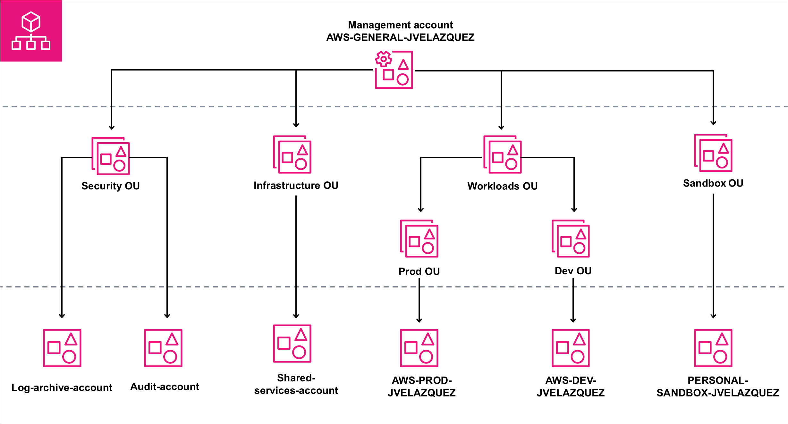

# AWS Multi-account Organization Lab

Laboratorio personal donde maqueto una **AWS Organization multi-cuenta** pensando ya
en un entorno real (aunque de tamaño pequeño) y lo documento como proyecto de portfolio.

Tecnologías principales:

- **AWS Organizations** (OUs y cuentas)
- **IAM + Service Control Policies (SCP)**
- **IAM Identity Center (SSO)**

No es una landing zone corporativa, pero sí una base seria para practicar gobernanza en AWS.

---

## Diagrama principal



> El diseño completo se explica en `docs/02-architecture.md`.

---

## Estructura del repositorio

```text
aws-organization/
├── docs/
│   ├── 01-overview.md              # Contexto y objetivos del laboratorio
│   ├── 02-architecture.md          # Cuentas, OUs y principios de diseño
│   ├── 03-implementation.md        # Pasos que he seguido (how-to)
│   ├── 04-current-configuration.md # Foto real de la organización hoy
│   └── 05-lessons-learned.md       # Qué he aprendido y cómo lo ampliaría
│
├── docs/scp/                       # SCP en JSON
│   ├── SCP-Restrict-Regions.json
│   ├── SCP-Restrict-Root.json
│   ├── SCP-Protect-CloudTrail.json
│   └── SCP-Limit-Sandbox-Costs.json
│
└── docs/screenshots/               # Capturas de consola y diagramas
````
## Nota sobre costes

El laboratorio está pensado para minimizar gasto, pero:

- Conviene crear **AWS Budgets** con alertas antes de montar la Organization.
- En mi caso, al usar una cuenta con créditos como **Management Account**, los créditos
  dejaron de aplicarse al unirse a la AWS Organization.

Lo dejo reflejado porque influye en cómo elegir la cuenta de administración en la vida real.
