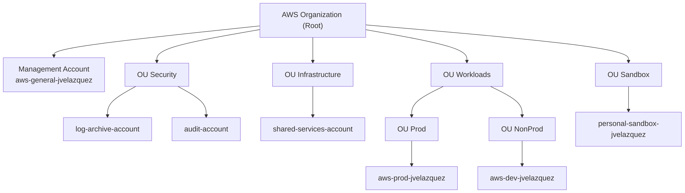

# 02 - Arquitectura

En este archivo explico **cómo quiero que esté montada la organización de AWS** a nivel
de cuentas y OUs.  

Primero muestro el **diagrama**, y después comento de forma sencilla por qué lo he
diseñado así y qué función tiene cada parte.

---

## 1. Diagrama de la organización

## 2. Visión general

La idea es tener una **landing zone multi-cuenta** que esté ordenada y sea fácil de entender:

- Una cuenta principal para **gobernanza y facturación** (Management Account).
- Unas OUs de **seguridad** y **servicios compartidos**.
- Otras OUs para las **cargas de trabajo**:
  - Producción.
  - No producción (desarrollo).
- Una OU de **Sandbox** para hacer pruebas sin miedo.

En el laboratorio que estoy haciendo ahora mismo **solo existen de verdad** estas cuentas:

- `aws-general-jvelazquez` (Management Account).
- `aws-prod-jvelazquez` (Producción).
- `aws-dev-jvelazquez` (Desarrollo / NonProd).

El resto de cuentas (logs, auditoría, servicios compartidos, sandbox personal) están
pensadas como **arquitectura objetivo**. Es decir, forman parte del diseño que me
gustaría tener en un entorno más completo.

---

## 3. Principios básicos del diseño

He seguido estas ideas para organizarlo:

- **Separar funciones**  
  No mezclar en la misma cuenta producción, desarrollo, seguridad y facturación.
  Cada cosa tiene su sitio.

- **Reducir el impacto de errores**  
  Si rompo algo en Desarrollo o Sandbox, no quiero afectar a Producción.  
  Por eso Prod y NonProd están en cuentas diferentes y en OUs distintas.

- **Aplicar reglas por grupo de cuentas**  
  Más adelante usaré **SCPs** a nivel de OU (por ejemplo, reglas más estrictas en
  Producción que en Desarrollo).

- **Pensar a futuro**  
  Aunque ahora solo use unas pocas cuentas, esta estructura me permite añadir más
  fácilmente:
  - Nuevas apps en Prod/NonProd.
  - Nuevas cuentas de seguridad.
  - Más sandboxes para equipos o personas.

