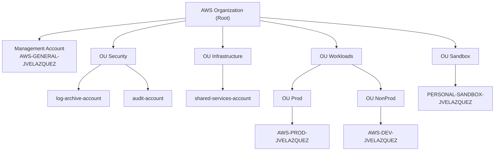

# 02 - Arquitectura

En este archivo explico **cómo quiero que esté montada la organización de AWS** a nivel
de cuentas y OUs.

Primero muestro el **diagrama general**, y después comento de forma sencilla:

- La idea global de la landing zone.
- Los principios que he seguido al diseñarla.
- La diferencia entre lo que **ya existe** en el laboratorio y lo que es **arquitectura objetivo**.
- Cómo se relaciona esto con la capa de gobernanza y el acceso centralizado.

---

## 1. Diagrama de la organización

Este diagrama representa la **arquitectura objetivo** de la organización, no solo el
estado actual del laboratorio. Más abajo explico qué partes están ya desplegadas y
cuáles son todavía diseño.

---

## 2. Visión general

La idea es tener una **landing zone multi-cuenta** que esté ordenada y sea fácil de
entender y mantener con el tiempo:

- Una cuenta principal para **gobernanza y facturación** (Management Account).
- Una OU de **Seguridad**, donde vivirán las cuentas relacionadas con logs y auditoría.
- Una OU de **Infraestructura**, para servicios compartidos que utilizarán varias
  aplicaciones.
- Una OU de **Workloads**, que agrupa las cargas de trabajo de negocio:
  - Sub-OU de **Producción**.
  - Sub-OU de **No Producción / Desarrollo**.
- Una OU de **Sandbox** para entornos de pruebas personales y experimentos.

En el laboratorio que estoy realizando ahora mismo, **las cuentas que existen de verdad**
son:

- `AWS-GENERAL-JVELAZQUEZ` → Management Account.
- `AWS-PROD-JVELAZQUEZ` → cuenta de Producción.
- `AWS-DEV-JVELAZQUEZ` → cuenta de Desarrollo / NonProd.
- `PERSONAL-SANDBOX-JVELAZQUEZ` → cuenta de sandbox personal.

El resto de cuentas:

- `log-archive-account`
- `audit-account`
- `shared-services-account`

forman parte de la **arquitectura objetivo**. Es decir, están pensadas para un entorno
más completo, pero todavía no las he desplegado en este laboratorio.

---

## 3. Principios básicos del diseño

A la hora de definir esta organización he seguido una serie de ideas sencillas, pero
que ayudan a que la estructura tenga sentido a futuro.

### 3.1 Separación de responsabilidades

- No mezclar en la misma cuenta:
  - Facturación y gobernanza.
  - Cargas de trabajo de negocio.
  - Seguridad y logging.
  - Servicios compartidos.
- La **Management Account** se reserva para:
  - Consolidar la facturación.
  - Definir la gobernanza central (SCP, OUs, etc.).
  - Gestionar IAM Identity Center y las cuentas miembro.

Las aplicaciones y servicios de negocio viven en cuentas distintas (Prod, Dev, etc.),
no en la Management Account.

### 3.2 Reducir el impacto de errores (blast radius)

- La cuenta de **Producción** está separada de **Desarrollo** y de **Sandbox**.
- Si hay un error grave en Desarrollo (por ejemplo, borrar recursos o desplegar algo
  mal), el impacto se queda en esa cuenta.
- La OU de **Sandbox** permite hacer pruebas más libres sin tocar ni Prod ni Dev.

Esta separación también facilita aplicar políticas más estrictas en entornos críticos
y políticas más flexibles en entornos de pruebas.

### 3.3 Gobernanza basada en OUs

La estructura de OUs no es solo “estética”, está pensada para que tenga sentido a la
hora de aplicar gobernanza:

- La OU **Security** agrupa las cuentas que serán consideradas “críticas” para la
  parte de logs y auditoría (por ejemplo, donde resida CloudTrail centralizado).
- La OU **Infrastructure** agrupa recursos compartidos que podrían dar servicio a
  varias aplicaciones (bastion, ECR, herramientas internas).
- La OU **Workloads** separa **Producción** y **No Producción** para poder aplicar
  políticas diferentes (por ejemplo, SCP más restrictivas en Prod).
- La OU **Sandbox** tiene sus propias reglas, más centradas en controlar el coste y
  el riesgo de pruebas.

Esta forma de diseñar las OUs encaja de forma natural con las SCP que describo en
`04-organization-configuration.md`.

### 3.4 Seguridad como capa transversal

Aunque en este archivo no entro al detalle de las SCP ni de IAM Identity Center, la
arquitectura está pensada para:

- Proteger servicios clave como **CloudTrail** en las cuentas de Seguridad.
- Evitar el uso del **usuario root** salvo casos muy concretos.
- Definir desde el principio dónde se centralizarán los logs (log-archive, audit).
- Dejar preparado el terreno para aplicar restricciones de regiones, tipos de recursos,
  etc., de forma coherente por OU.

Es decir, la seguridad no se añade “al final”, sino que condiciona cómo se agrupan las
cuentas y por qué existen ciertas OUs.

### 3.5 Escalabilidad y crecimiento futuro

Aunque ahora mismo el laboratorio es pequeño, el diseño busca que sea fácil crecer:

- Puedo añadir nuevas cuentas de carga de trabajo (por ejemplo, `app1-prod`,
  `app1-dev`) dentro de las OUs de Workloads sin tener que rediseñar todo.
- La OU de **Infraestructura** puede ir incorporando servicios como:
  - Repositorios de imágenes (ECR).
  - Herramientas de observabilidad.
  - Servicios de red compartidos.
- La OU de **Security** puede ampliarse con más cuentas dedicadas a:
  - Respuesta a incidentes.
  - Monitorización avanzada.
  - Integración con herramientas externas de seguridad.

El objetivo es que el diseño base aguante bien tanto en un entorno de laboratorio como
en un escenario más cercano a producción.

---

## 4. Estado actual vs arquitectura objetivo

Para dejar clara la diferencia entre lo que ya está desplegado y lo que es solo diseño,
podemos verlo así:

- **Desplegado actualmente:**
  - AWS Organization con:
    - `AWS-GENERAL-JVELAZQUEZ` (Management Account).
    - `AWS-PROD-JVELAZQUEZ` (Producción).
    - `AWS-DEV-JVELAZQUEZ` (Desarrollo).
    - `PERSONAL-SANDBOX-JVELAZQUEZ` (Sandbox personal).
  - OUs:
    - `Security` (vacía, por ahora).
    - `Infrastructure` (vacía, por ahora).
    - `Workloads/Producción` con `AWS-PROD-JVELAZQUEZ`.
    - `Workloads/Desarrollo` con `AWS-DEV-JVELAZQUEZ`.
    - `Sandbox` con `PERSONAL-SANDBOX-JVELAZQUEZ`.

- **Arquitectura objetivo (planificada, no desplegada todavía):**
  - Cuenta `log-archive-account` en la OU `Security`.
  - Cuenta `audit-account` en la OU `Security`.
  - Cuenta `shared-services-account` en la OU `Infrastructure`.

Esta distinción es importante de cara a portfolio: muestra que el diseño está pensado
para ir más allá del laboratorio, pero sin ocultar qué partes están implementadas y
cuáles son todavía futuras.

---

## 5. Relación con la gobernanza y el acceso

Por último, esta arquitectura no vive aislada. Se conecta directamente con:

- La **capa de gobernanza** descrita en `04-organization-configuration.md`:
  - Aplicación de SCP globales (por ejemplo, restricción de regiones y uso de root).
  - SCP específicas para Sandbox y para las futuras cuentas de Seguridad.
- El **modelo de acceso centralizado** basado en **IAM Identity Center**:
  - Usuarios y grupos (por ejemplo, el grupo `Administradores`).
  - Conjuntos de permisos como `AdministratorAccess`.
  - Asignación de estos permisos a las cuentas de `Workloads` a través del portal.

En resumen:

- El capítulo **02 – Arquitectura** explica **cómo estructuro la organización** a nivel
  de cuentas y OUs.
- El capítulo **03 – Implementation** explica **cómo he creado, paso a paso**, los
  recursos principales en el laboratorio.
- El capítulo **04 – Configuración actual** muestra **la foto real** de lo que está
  desplegado, incluyendo SCP e Identity Center, apoyándose en esta arquitectura.

