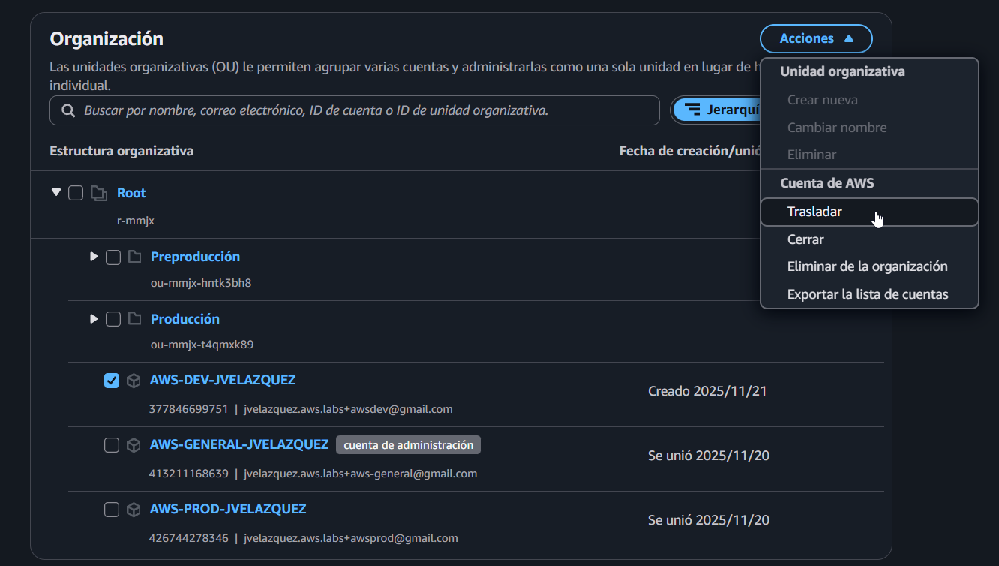
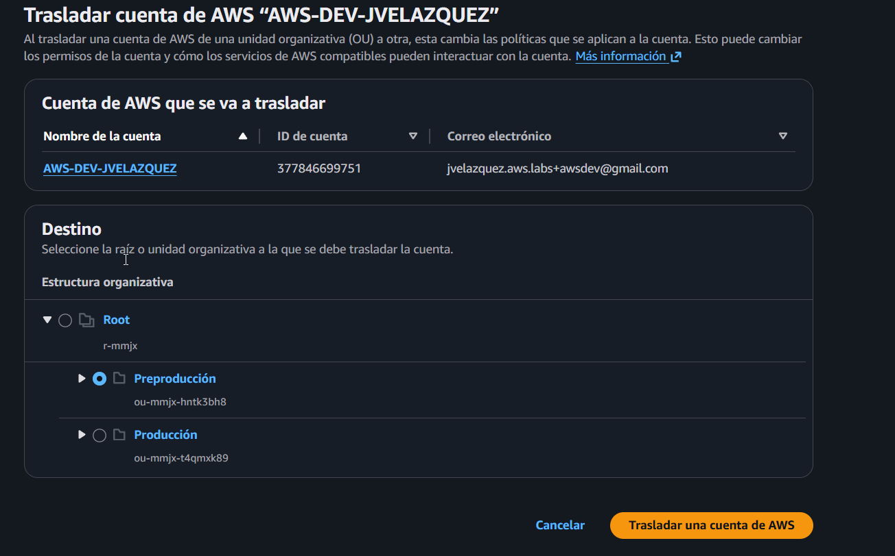

# 03 - Implementation

## 1. - Prerrequisitos

- Cuenta de AWS que actuará como **Management Account** con permisos administrativos sobre AWS Organizations.
- Billing correctamente configurado en la Management Account.
- Acceso a la cuenta que se va a invitar (en este caso, la cuenta de producción), evitando el uso del usuario root salvo para tareas imprescindibles.

## 2. - Creación de la AWS Organization

El primer paso es crear una **AWS Organization** a partir de la cuenta que actuará como 
**Management Account**. Esta cuenta será la responsable de la gobernanza global, la 
facturación consolidada y la gestión de las cuentas miembro.

1. Desde un usuario IAM con los permisos necesarios en la Management Account (evitando 
   así el uso del usuario root cuando no es imprescindible), nos dirigimos a **AWS Organizations**.
   
2. Seleccionamos **Crear una organización**.

3. Una vez creada la organización, podremos ver la estructura inicial, que irá creciendo 
   en función del número de cuentas que gestionemos desde aquí.

## 3. - Gestión de cuentas en la AWS Organization

En este laboratorio, además de la Management Account, se añade una cuenta adicional que 
simulará el entorno de **producción**. Para ello, se invita una cuenta existente a la 
organización y se configura un rol que permita a la Management Account administrarla.

### 3.1 - Invitación de la cuenta de producción

1. Desde la Management Account, en el panel de **AWS Organizations**, seleccionamos 
   **Agregar una cuenta de AWS**.
2. Indicamos el **ID de la cuenta** a invitar o el **correo electrónico** asociado.
   En este caso, se ha creado previamente una cuenta root de producción para añadirla 
   a esta organización. A continuación, pulsamos en **Enviar petición**.

3. Ahora, accedemos a la consola de administración de AWS con la cuenta que hemos invitado.
   Una vez dentro de **AWS Organizations**, verificamos que hemos recibido la invitación:

4. Tras aceptar la invitación, volvemos a la Management Account y comprobamos cómo la 
   cuenta de producción se ha añadido correctamente a la organización:

### 3.2 - Creación del rol de acceso entre cuentas

Para que la Management Account pueda administrar la cuenta de producción sin utilizar
credenciales dedicadas, se crea un rol de IAM en la cuenta de producción que podrá ser
asumido desde la organización.

Este paso se realiza **desde la cuenta de producción**:

1. En el servicio **IAM**, seleccionamos **Roles** → **Create role**.
2. Elegimos **Cuenta de AWS** como tipo de entidad confiable e indicamos el ID de la 
   Management Account. De esta forma, solo esa cuenta podrá asumir el rol.

> Apunte: Cuando creamos la cuenta directamente desde la organización, en lugar de
> invitar a una cuenta existente como en este caso, el rol `OrganizationAccountAccessRole`
> se crea de manera automática.

3. Asignamos la política de permisos **AdministratorAccess**, ya que en este laboratorio
   queremos que la Management Account tenga control administrativo completo sobre la 
   cuenta de producción. En un entorno real podría restringirse a un subconjunto más
   específico de permisos.

4. Por último, creamos el rol con el nombre `OrganizationAccountAccessRole`.

### 3.3 Prueba de acceso desde la Management Account

Para validar que la configuración es correcta, probamos a asumir el rol recién creado
desde un usuario IAM de la Management Account:

1. Desde la consola de la Management Account, abrimos el menú de **Cambiar rol**.

2. Indicamos la cuenta de producción y el rol `OrganizationAccountAccessRole`. Acto seguido, le damos a **Cambiar función**.

3. Tras asumir el rol, la consola mostrará claramente que estamos operando dentro de la
   cuenta de producción utilizando el rol compartido, sin necesidad de utilizar
   credenciales directas de esa cuenta.

## 4. - Aprovisionamiento de nuevas cuentas desde AWS Organizations

En el apartado anterior se ha visto cómo **invitar una cuenta existente** a la organización
y crear manualmente el rol `OrganizationAccountAccessRole`.  
En este caso, se opta por un enfoque distinto: **crear una nueva cuenta directamente desde
la AWS Organization**, lo que simplifica parte del proceso y permite estandarizar la forma
en la que se añaden cuentas de forma más “automatizable”.

En este punto, la nueva cuenta creada representará el entorno de **Desarrollo**.

### 4.1 - Creación de la cuenta de Desarrollo desde la Organization

1. Desde la **Management Account**, accedemos al servicio **AWS Organizations**.
2. En la sección de cuentas, seleccionamos la opción **Crear una cuenta de AWS**.
3. Indicamos:
   - Nombre de la cuenta (por ejemplo, `Development` o similar).
   - Correo electrónico asociado a la nueva cuenta.
   - (Opcional) Un rol de IAM que se creará automáticamente para administrar la cuenta
     desde la organización. En este caso, se utiliza el rol por defecto 
     `OrganizationAccountAccessRole`

Una vez completado el asistente, AWS aprovisiona la nueva cuenta y la incorpora a la
organización. Tras unos instantes, se puede comprobar que la cuenta de Desarrollo ya
aparece junto con la Management Account y la cuenta de Producción:

> 💡 A diferencia del caso anterior (invitando una cuenta existente), cuando la cuenta se
> crea directamente desde la Organization, el rol `OrganizationAccountAccessRole` se
> genera automáticamente en la nueva cuenta, simplificando el flujo de administración.

### 4.2 Acceso a la cuenta de Desarrollo desde la Management Account

Al igual que con la cuenta de Producción, la Management Account puede asumir el rol
`OrganizationAccountAccessRole` en la cuenta de Desarrollo para administrarla sin utilizar
credenciales propias de esa cuenta.

1. Desde la consola de la Management Account, utilizamos la opción de **Cambiar rol**.
2. Seleccionamos la cuenta de Desarrollo en la lista de cuentas disponibles y escogemos
   el rol `OrganizationAccountAccessRole`.

3. Una vez asumido el rol, la consola mostrará que estamos operando dentro de la cuenta
   de Desarrollo bajo el rol compartido:

4. Por último, verificaremos que de manera automática, la cuenta de Desarrollo dispone del rol `OrganizationAccountAccessRole`.

## 5. - Unidades Organizativas (OU)

Una vez creadas las cuentas que formarán parte de la organización, el siguiente paso 
consiste en **agruparlas en Unidades Organizativas (Organizational Units, OU)**.  
Las OUs permiten aplicar políticas y gobernanza de forma centralizada a conjuntos de 
cuentas que comparten un mismo propósito (por ejemplo, Producción, Desarrollo, Sandbox, etc.).

En este laboratorio se han creado dos OUs principales bajo la raíz (`Root`):

- `Producción`
- `Desarrollo`

### 5.1 - Creación de la OU de Producción

1. Desde la **Management Account**, accedemos a **AWS Organizations** y a la vista de 
   **Organización**, donde se muestra la estructura actual de cuentas bajo `Root`.
2. En el menú **Acciones**, seleccionamos **Unidad organizativa → Crear nueva**.

3. En el formulario de creación, indicamos el nombre de la OU. En este caso, se crea
   la OU llamada `Producción`. Opcionalmente, se podrían añadir etiquetas para una
   mejor categorización y reporting.

4. Tras confirmar la operación, la OU `Producción` aparece bajo `Root` en la estructura 
   organizativa:

### 5.2 - Creación de la OU de Desarrollo

Del mismo modo, se crea una segunda OU destinada a entornos de **Desarrollo** o 
entornos anteriores a Producción.

1. Desde la misma vista de **Organización**, repetimos el proceso de **Unidad organizativa → Crear nueva**.
2. Asignamos el nombre `Desarrollo` a esta nueva OU.
3. Una vez creada, la estructura organizativa muestra ambas OUs (`Desarrollo` y 
   `Producción`) bajo `Root`.

### 5.3 - Situación inicial de las cuentas y objetivo de la reorganización

En este punto, la organización cuenta con tres cuentas principales:

- `AWS-GENERAL-JVELAZQUEZ` → Management Account (cuenta de administración).
- `AWS-PROD-JVELAZQUEZ` → cuenta destinada a producción.
- `AWS-DEV-JVELAZQUEZ` → cuenta destinada a desarrollo.

Inicialmente, todas las cuentas se encuentran directamente bajo `Root`.  
El objetivo es **mover las cuentas a la OU que les corresponde** para reflejar mejor 
su propósito y poder aplicar políticas diferenciadas en el futuro.

### 5.4 - Trasladar la cuenta de Desarrollo a la OU de Desarrollo

Aunque en un entorno real se podría optar por colocar la cuenta de desarrollo en una OU 
específica de `Sandbox` o `Development`, en este laboratorio se traslada la cuenta 
`AWS-DEV-JVELAZQUEZ` a la OU `Desarrollo` a modo de ejemplo de **reorganización de cuentas**.

1. Seleccionamos la cuenta `AWS-DEV-JVELAZQUEZ` en la vista de **Organización**.
2. En el menú **Acciones**, elegimos **Cuenta de AWS → Trasladar**.

3. En la pantalla de traslado, se muestra la cuenta que se va a mover y la estructura 
   de destino disponible. Seleccionamos la OU `Desarrollo` como destino y confirmamos 
   con **Trasladar una cuenta de AWS**.

4. Tras trasladar la cuenta de Desarrollo, procedemos de la misma manera con Producción y su unidad organizativa correspondiente.
   Tras completar el proceso, la estructura queda organizada de la siguiente manera:

