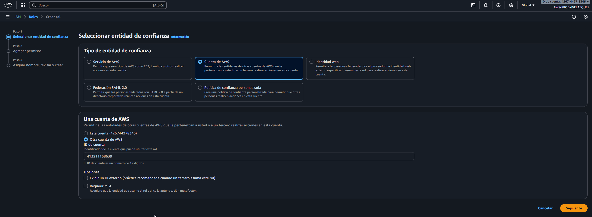
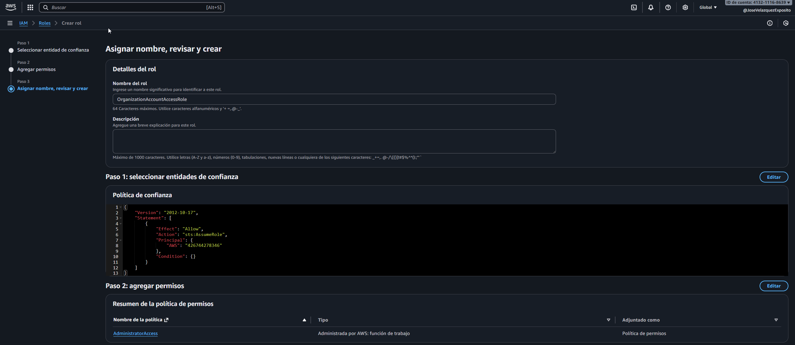
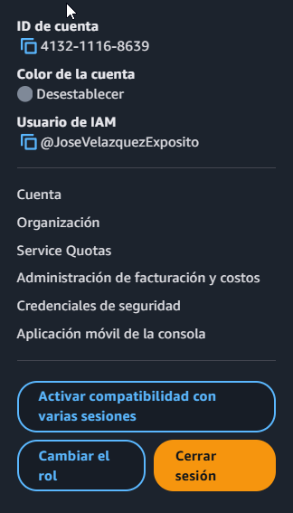

# 03 - Implementation

## 1. - Prerrequisitos

- Cuenta de AWS que actuará como **Management Account** con permisos administrativos sobre AWS Organizations.
- Billing correctamente configurado en la Management Account.
- Acceso a la cuenta que se va a invitar (en este caso, la cuenta de producción), evitando el uso del usuario root salvo para tareas imprescindibles.

## 2. - Creación de la AWS Organization

El primer paso es crear una **AWS Organization** a partir de la cuenta que actuará como 
**Management Account**. Esta cuenta será la responsable de la gobernanza global, la 
facturación consolidada y la gestión de las cuentas miembro.

1. Desde un usuario IAM con los permisos necesarios en la Management Account (evitando 
   así el uso del usuario root cuando no es imprescindible), nos dirigimos a **AWS Organizations**.
   
2. Seleccionamos **Crear una organización**.

3. Una vez creada la organización, podremos ver la estructura inicial, que irá creciendo 
   en función del número de cuentas que gestionemos desde aquí.

## 3. - Gestión de cuentas en la AWS Organization

En este laboratorio, además de la Management Account, se añade una cuenta adicional que 
simulará el entorno de **producción**. Para ello, se invita una cuenta existente a la 
organización y se configura un rol que permita a la Management Account administrarla.

### 3.1 - Invitación de la cuenta de producción

1. Desde la Management Account, en el panel de **AWS Organizations**, seleccionamos 
   **Agregar una cuenta de AWS**.
2. Indicamos el **ID de la cuenta** a invitar o el **correo electrónico** asociado.
   En este caso, se ha creado previamente una cuenta root de producción para añadirla 
   a esta organización. A continuación, pulsamos en **Enviar petición**.

3. Ahora, accedemos a la consola de administración de AWS con la cuenta que hemos invitado.
   Una vez dentro de **AWS Organizations**, verificamos que hemos recibido la invitación:

4. Tras aceptar la invitación, volvemos a la Management Account y comprobamos cómo la 
   cuenta de producción se ha añadido correctamente a la organización:

### 3.2 - Creación del rol de acceso entre cuentas

Para que la Management Account pueda administrar la cuenta de producción sin utilizar
credenciales dedicadas, se crea un rol de IAM en la cuenta de producción que podrá ser
asumido desde la organización.

Este paso se realiza **desde la cuenta de producción**:

1. En el servicio **IAM**, seleccionamos **Roles** → **Create role**.
2. Elegimos **Cuenta de AWS** como tipo de entidad confiable e indicamos el ID de la 
   Management Account. De esta forma, solo esa cuenta podrá asumir el rol.

> Apunte: Cuando creamos la cuenta directamente desde la organización, en lugar de
> invitar a una cuenta existente como en este caso, el rol **OrganizationAccountAccessRole**
> se crea de manera automática.

3. Asignamos la política de permisos **AdministratorAccess**, ya que en este laboratorio
   queremos que la Management Account tenga control administrativo completo sobre la 
   cuenta de producción. En un entorno real podría restringirse a un subconjunto más
   específico de permisos.

4. Por último, creamos el rol con el nombre **OrganizationAccountAccessRole**.

### 3.3 Prueba de acceso desde la Management Account

Para validar que la configuración es correcta, probamos a asumir el rol recién creado
desde un usuario IAM de la Management Account:

1. Desde la consola de la Management Account, abrimos el menú de **Cambiar rol**.

2. Indicamos la cuenta de producción y el rol **OrganizationAccountAccessRole**. Acto seguido, le damos a **Cambiar función**.

> En **Nombre para mostrar** indiqué **PROD**, pero tomé la captura antes de ello.

3. Tras asumir el rol, la consola mostrará claramente que estamos operando dentro de la
   cuenta de producción utilizando el rol compartido, sin necesidad de utilizar
   credenciales directas de esa cuenta.

> Se puede observar cómo arriba a la derecha aparece el **PROD** que añadí en **Nombre para mostrar**

## 4. - Automatización de procesos en las AWS Organization

## 5. - Unidades Organizativas (OU)

