# 03 - Implementation (How-to)

En este archivo no describo la arquitectura final, sino un **how-to práctico** con los
pasos que he seguido en la consola para montar la base de la organización:

- Crear la **AWS Organization**.
- Añadir cuentas de **Producción** y **Desarrollo**.
- Crear **OUs** y mover las cuentas.
- Probar una **SCP de ejemplo**.
- Habilitar **IAM Identity Center** y configurar un acceso administrativo básico.

El diseño completo (todas las OUs, cuentas y políticas finales) está en  
`02-architecture.md`. Aquí me centro en el “cómo lo hice”.

---

## Tabla de contenidos

- [1. Prerrequisitos](#1-prerrequisitos)
- [2. Creación de la AWS Organization](#2-creación-de-la-aws-organization)
- [3. Gestión de cuentas](#3-gestión-de-cuentas)
  - [3.1 Invitación de la cuenta de Producción](#31-invitación-de-la-cuenta-de-producción)
  - [3.2 Rol de acceso entre cuentas](#32-rol-de-acceso-entre-cuentas)
  - [3.3 Prueba de acceso cruzado](#33-prueba-de-acceso-desde-la-management-account)
- [4. Creación de la cuenta de Desarrollo](#4-creación-de-la-cuenta-de-desarrollo)
- [5. Unidades Organizativas (OU)](#5-unidades-organizativas-ou)
- [6. SCP de ejemplo (`IAMDeny`)](#6-service-control-policies-scp--ejemplo-de-denegación-de-iam)
- [7. IAM Identity Center – Flujo básico](#7-iam-identity-center--configuración-inicial)

---

## 1. Prerrequisitos

Antes de empezar, necesito:

- Una cuenta de AWS que actuará como **Management Account**, con permisos
  administrativos sobre **AWS Organizations**.
- Facturación configurada en la Management Account.
- Acceso a la cuenta que usaré como **Producción**, evitando usar el usuario root
  salvo cuando sea estrictamente necesario.

---

## 2. Creación de la AWS Organization

1. Con un usuario IAM con permisos administrativos en la Management Account, entro en  
   **AWS Organizations**.
2. Selecciono **Crear una organización**.


3. Al finalizar, la consola muestra la organización con la Management Account como
   primera cuenta.

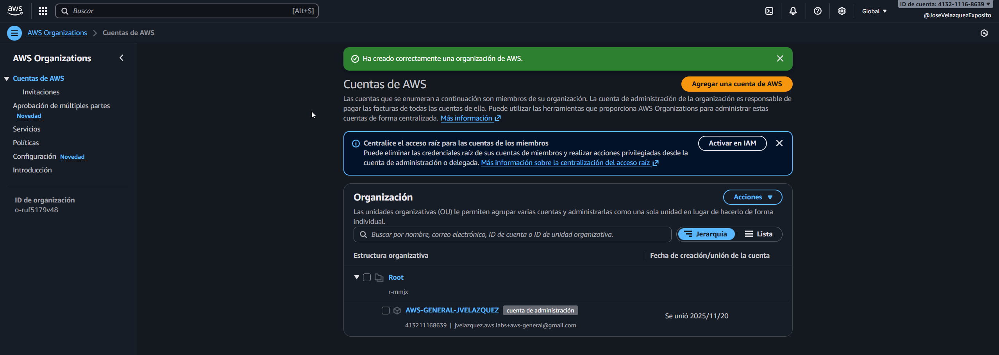

---

## 3. Gestión de cuentas

En este laboratorio añado primero una cuenta que actúa como **Producción**, invitando
una cuenta existente a la organización.

### 3.1 Invitación de la cuenta de Producción

1. Desde la Management Account, en **AWS Organizations**, selecciono  
   **Agregar una cuenta de AWS**.
2. Indico el **ID de la cuenta** o el **correo electrónico** de la cuenta de Producción
   y hago clic en **Enviar petición**.

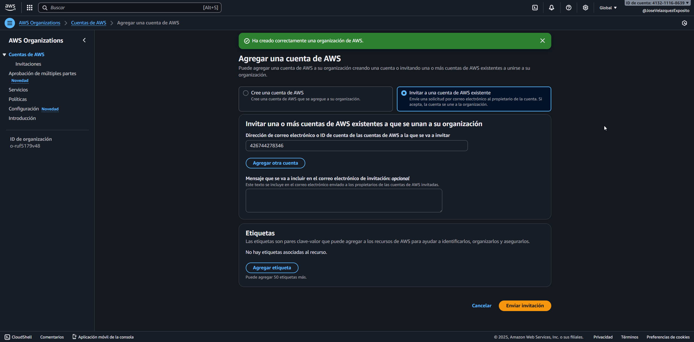

3. Entro en la consola de AWS con la cuenta invitada y, en **AWS Organizations**,
   acepto la invitación.

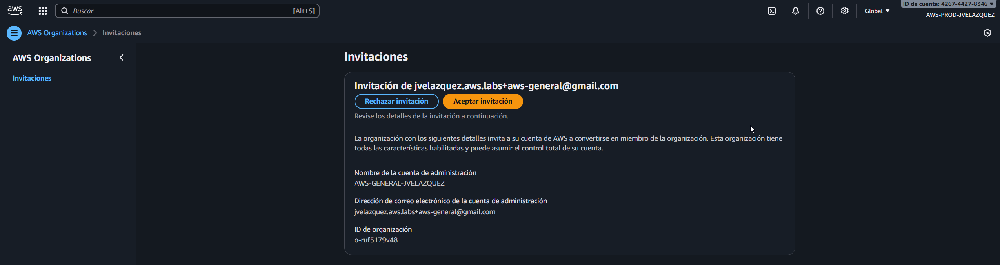

4. De vuelta en la Management Account, veo ya ambas cuentas en la organización.

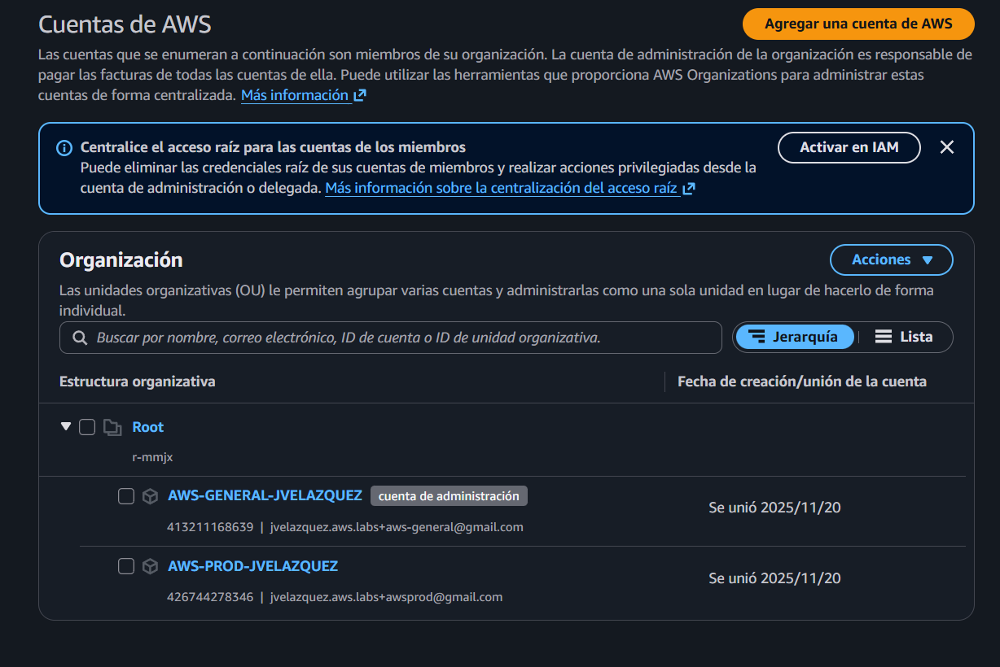

### 3.2 Rol de acceso entre cuentas

Quiero que la Management Account pueda administrar la cuenta de Producción sin usar
credenciales propias de esa cuenta, así que creo un rol de IAM “asumible” desde la
organización.

> Cuando una cuenta se **crea** desde Organizations, el rol
> `OrganizationAccountAccessRole` se genera automáticamente.  
> Aquí muestro el caso de una **cuenta invitada**.

Pasos (desde la cuenta de Producción):

1. Voy a **IAM → Roles → Create role**.
2. Elijo **Cuenta de AWS** como tipo de entidad confiable e indico el ID de la
   Management Account.


3. Asigno la política **AdministratorAccess** (en un entorno real se debería
   restringir más).
4. Creo el rol con nombre `OrganizationAccountAccessRole`.


### 3.3 Prueba de acceso desde la Management Account

Para comprobar que todo funciona:

1. Desde la Management Account, uso el menú **Cambiar rol**.


2. Indico la cuenta de Producción y el rol `OrganizationAccountAccessRole` y confirmo.

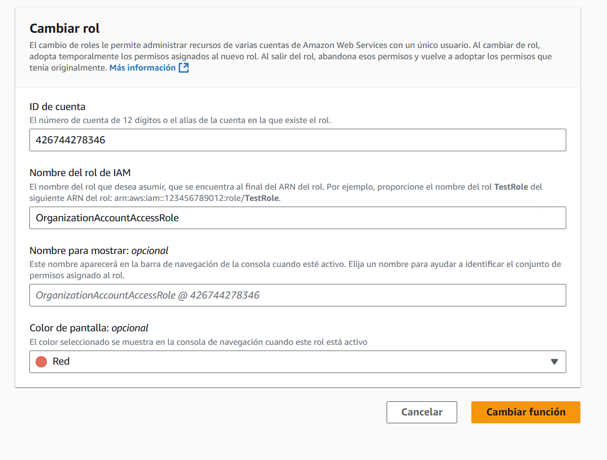

3. La consola muestra que estoy operando dentro de la cuenta de Producción con ese rol.

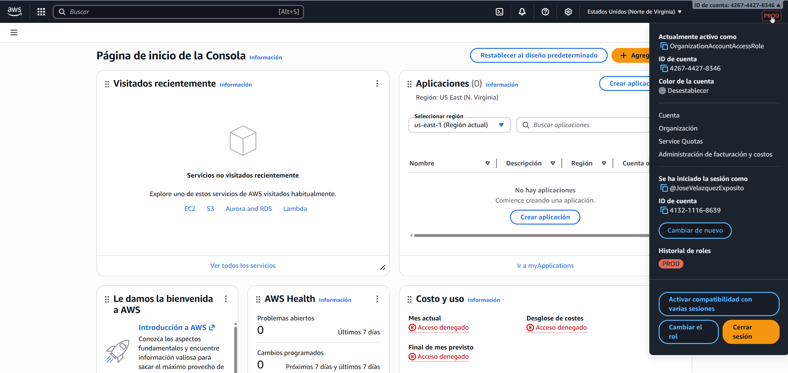

---

## 4. Creación de la cuenta de Desarrollo

En este caso, creo la cuenta de **Desarrollo** directamente desde la organización,
para ver el otro flujo (no invitación).

1. Desde la Management Account, en **AWS Organizations**, selecciono  
   **Crear una cuenta de AWS**.
2. Relleno:
   - Nombre: por ejemplo, `Development`.
   - Correo electrónico de la nueva cuenta.
   - Rol por defecto: `OrganizationAccountAccessRole`.

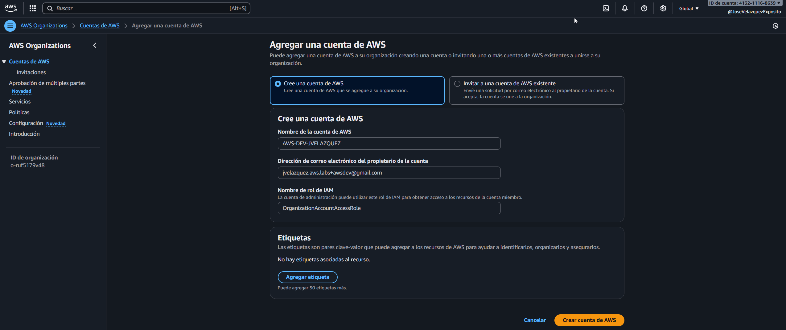

Al terminar, la organización muestra tres cuentas: Management, Producción y Desarrollo.

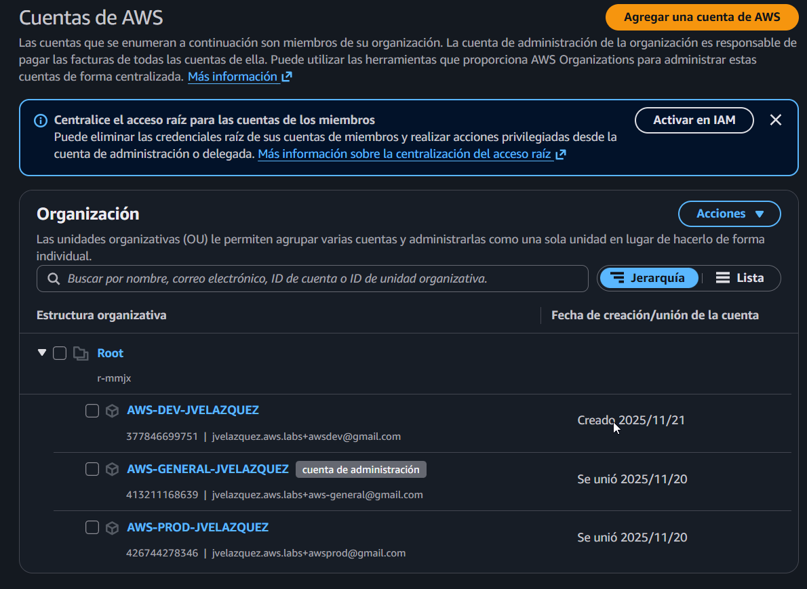

En este caso, AWS crea automáticamente el rol `OrganizationAccountAccessRole` en la
nueva cuenta de Desarrollo.

El acceso desde la Management Account se realiza igual que en Producción:

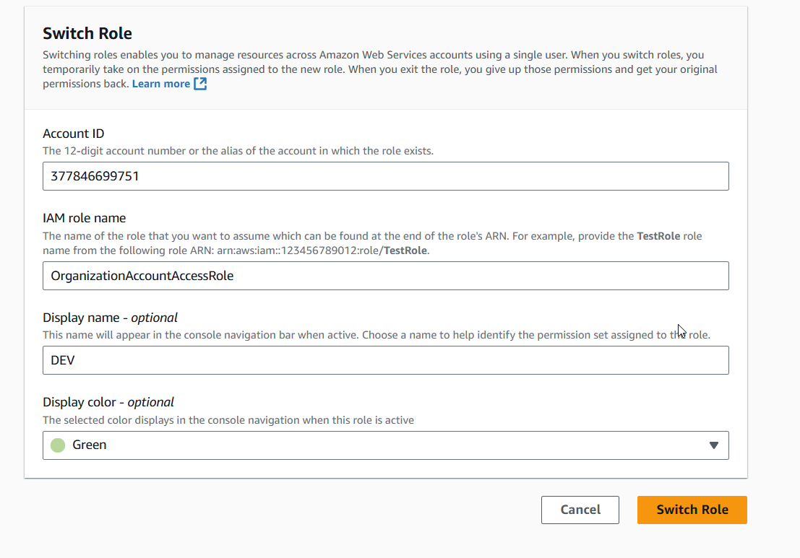

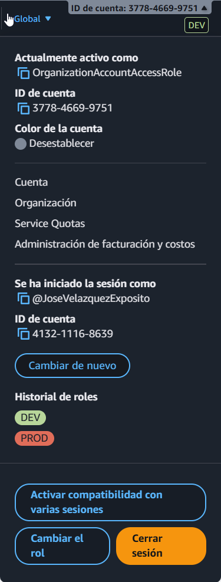


---

## 5. Unidades Organizativas (OU)

Con las cuentas creadas, agrupo Producción y Desarrollo en **OUs** para poder aplicar
políticas por bloque.

En este laboratorio creo dos OUs bajo la raíz (`Root`):

- `Producción`
- `Desarrollo`

> Más adelante, en la arquitectura final, añado OUs de Security, Infrastructure, Sandbox, etc.

### 5.1 Creación de la OU de Producción

1. Desde la Management Account, en **AWS Organizations → Organización**, abro la vista
   del árbol bajo `Root`.
2. En **Acciones → Unidad organizativa → Crear nueva**.

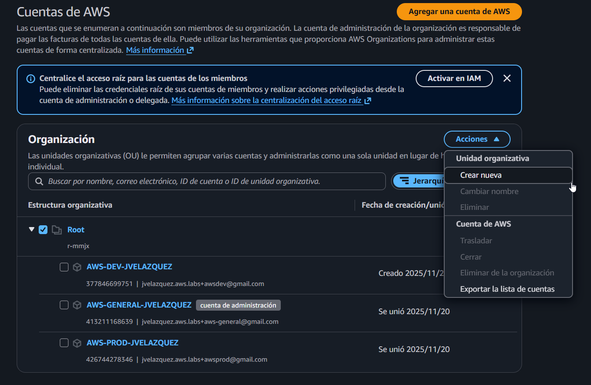

3. Asigno el nombre `Producción` y confirmo.

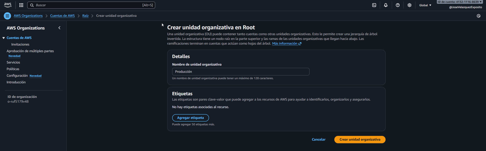

La OU aparece bajo `Root`:

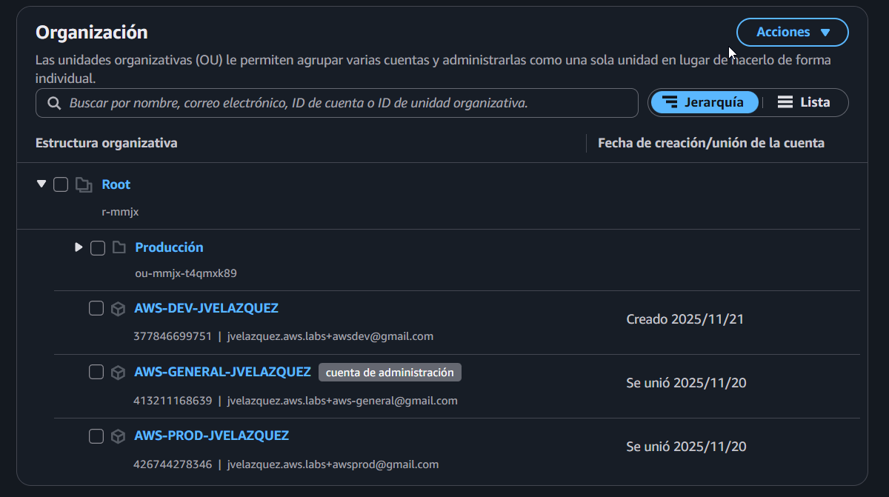

### 5.2 Creación de la OU de Desarrollo y movimiento de cuentas

Repito el proceso para `Desarrollo` y, a continuación, muevo cada cuenta a su OU:

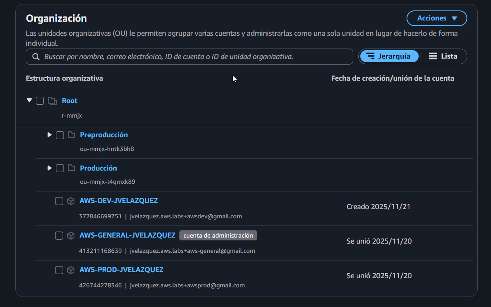

Pasos para mover una cuenta:

1. Selecciono la cuenta en la vista de **Organización**.
2. **Acciones → Cuenta de AWS → Trasladar**.
3. Selecciono la OU destino (`Producción` o `Desarrollo`) y confirmo.

Al final, la estructura queda así:

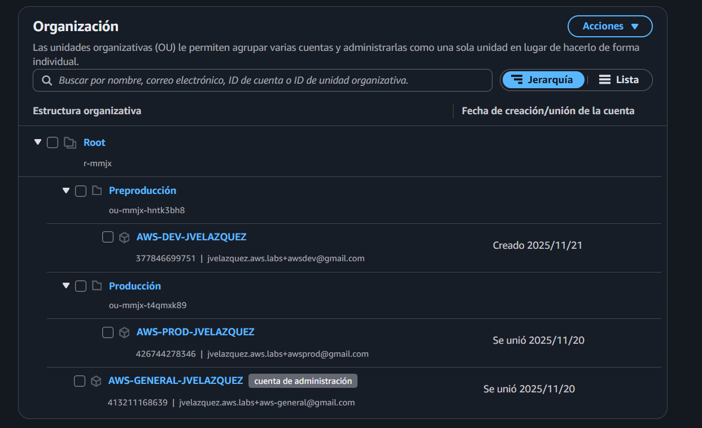

---

## 6. Service Control Policies (SCP) – Ejemplo de denegación de IAM

Aquí no defino todavía las SCP “buenas” del diseño final, sino que creo una SCP
de laboratorio (`IAMDeny`) para entender su efecto.

Objetivo de `IAMDeny`: **negar todo IAM** en la cuenta de Producción.

> Es una política intencionadamente agresiva, solo para fines de práctica.

### 6.1 Habilitar las SCP

1. Desde la Management Account, voy a  
   **AWS Organizations → Políticas → Políticas de control de servicios**.
2. Pulso **Habilitar políticas de control de servicios**.

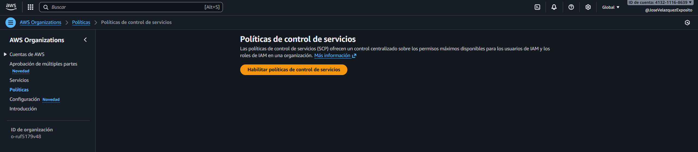

A partir de ahí, la pestaña de SCP queda disponible:

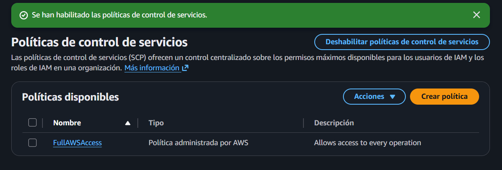

### 6.2 Creación de la política `IAMDeny`

1. En **Políticas de control de servicios**, elijo **Crear política**.
2. Datos básicos:
   - Nombre: `IAMDeny`
   - Descripción: `Denegación del uso de IAM en la cuenta de producción`.

3. En el editor añado un único statement:

```json
{
  "Version": "2012-10-17",
  "Statement": [
    {
      "Effect": "Deny",
      "Action": "iam:*",
      "Resource": "*"
    }
  ]
}
```

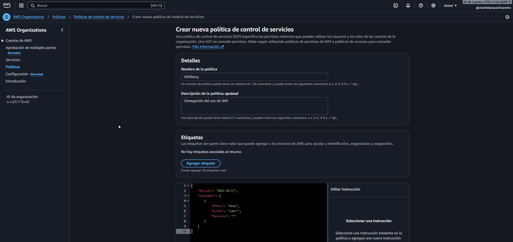

4. Guardo la política. `IAMDeny` aparece ahora como política administrada por el cliente:

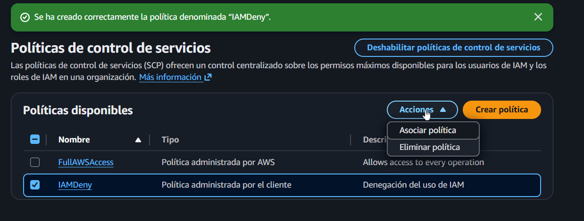

---

### 6.3 Asociación de la SCP a la cuenta de Producción

1. Selecciono la política `IAMDeny` en la lista de SCP.
2. En **Acciones**, elijo **Asociar política**.
3. En la pantalla de destinos, navego por la estructura de la organización y marco  
   la cuenta `AWS-PROD-JVELAZQUEZ` dentro de la OU de Producción.
4. Confirmo con **Asociar política**.


Desde ese momento, la cuenta de Producción queda sujeta a las restricciones de `IAMDeny`.

---

### 6.4 Verificación del efecto de la SCP

1. Desde la Management Account, asumo el rol `OrganizationAccountAccessRole` en la cuenta
   de Producción.
2. En la consola de **IAM** de esa cuenta, intento realizar acciones básicas como:
   - `iam:GetAccountSummary`
   - `iam:ListAccountAliases`

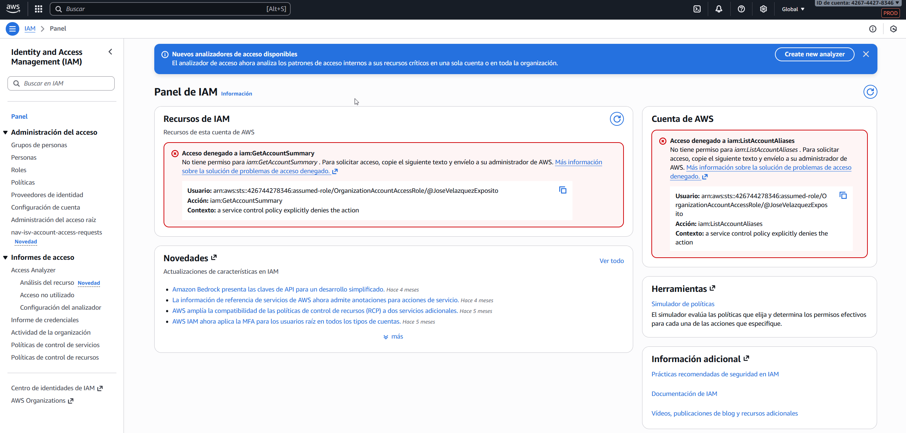

Las operaciones fallan con un mensaje indicando que **una Service Control Policy deniega
explícitamente la acción**, lo que confirma que `IAMDeny` está funcionando como se esperaba.

> Nota: esta SCP es solo un ejemplo de laboratorio y no forma parte del diseño final.

## 7. IAM Identity Center – Configuración inicial

En este último apartado habilito **IAM Identity Center** y configuro un flujo básico
de acceso administrativo:

- Instancia de Identity Center para la organización.
- Un **permission set** (`AdministratorAccess`).
- Un **grupo** (`Administradores`).
- Un **usuario de ejemplo** (`Alicia`).
- Asignación del grupo a las cuentas de **Dev** y **Prod** y verificación vía portal.

El objetivo es tener un SSO sencillo pero funcional para los administradores del laboratorio.

---

### 7.1 Habilitar la instancia de IAM Identity Center

1. Desde la **Management Account**, accedo a **IAM Identity Center**.
2. En la pantalla inicial, AWS explica el servicio y permite **activar** la instancia
   para la organización.

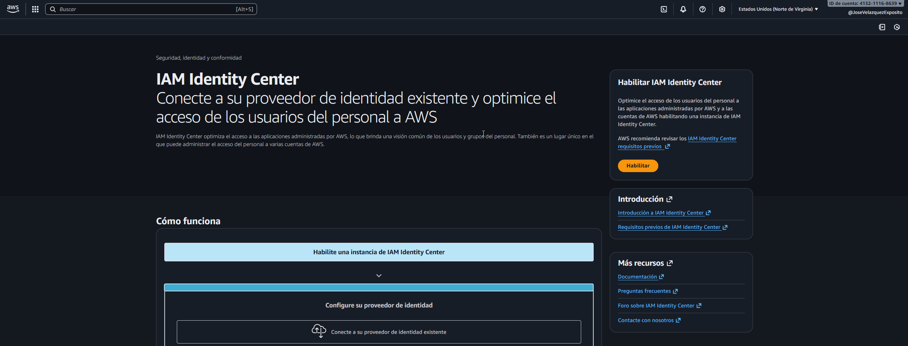

3. Selecciono la región (en este laboratorio, `us-east-1`) y dejo la configuración
   avanzada por defecto.
4. Pulso **Activar**.

Tras unos segundos, se muestra la página de la instancia:

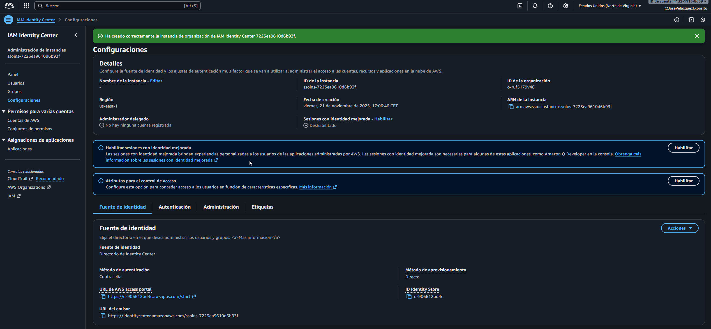

---

### 7.2 Fuente de identidad y portal de acceso

Para este laboratorio utilizo la opción más simple:

- **Fuente de identidad**: *Directorio de Identity Center*  
  (usuarios y grupos gestionados directamente en AWS).
- **Autenticación**: contraseña.

Después personalizo la URL del portal:

1. En **Configuración de IAM Identity Center**, edito la **URL de AWS access portal**.
2. Indico el subdominio `josevelazquez` y guardo.

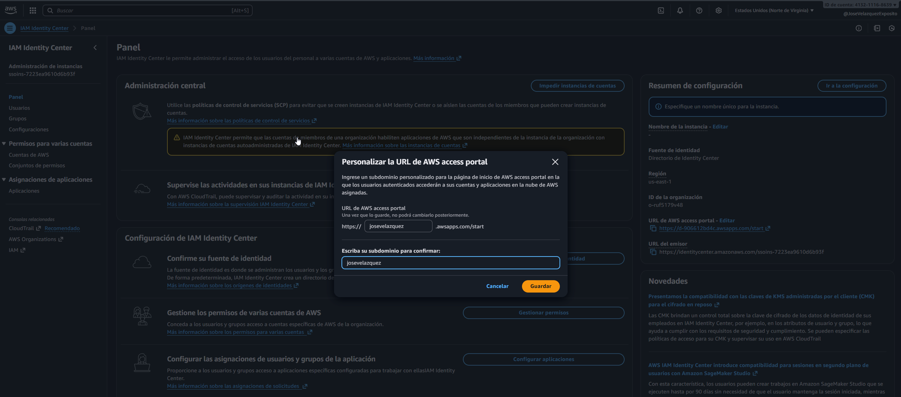

La URL final del portal es:

```text
https://josevelazquez.awsapps.com/start
```

### 7.3 Conjunto de permisos `AdministratorAccess`

Creo un permission set predefinido para tareas de administración:

1. En **Permisos para varias cuentas → Conjuntos de permisos**, selecciono  
   **Crear conjunto de permisos**.
2. En el **Paso 1**, elijo:
   - Tipo: **Conjunto de permisos predefinido**.
   - Política: `AdministratorAccess`.

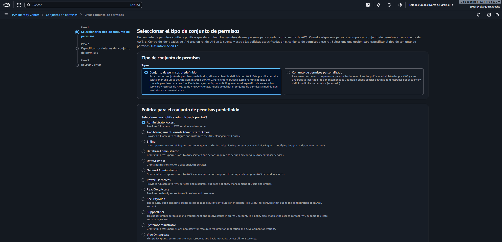

3. En el **Paso 2**, dejo:
   - Nombre: `AdministratorAccess`.
   - (Opcional) Descripción: `Conjunto de permisos administrativo para el laboratorio`.
   - Duración de sesión: 4 horas.

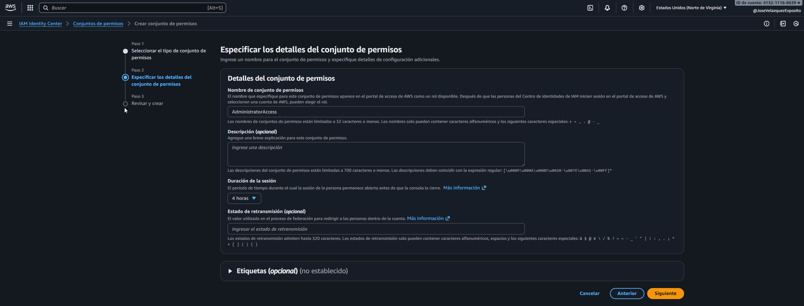

4. En el **Paso 3**, reviso y pulso **Crear**.

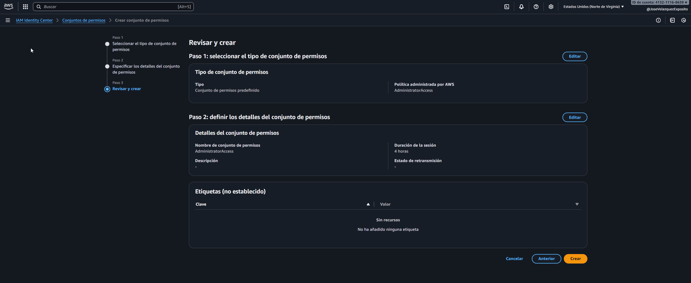

---

### 7.4 Grupo `Administradores`

Para asignar permisos de forma más ordenada, creo un grupo:

1. En **Grupos**, selecciono **Crear grupo**.
2. Configuro:
   - Nombre: `Administradores`
   - Descripción (opcional).

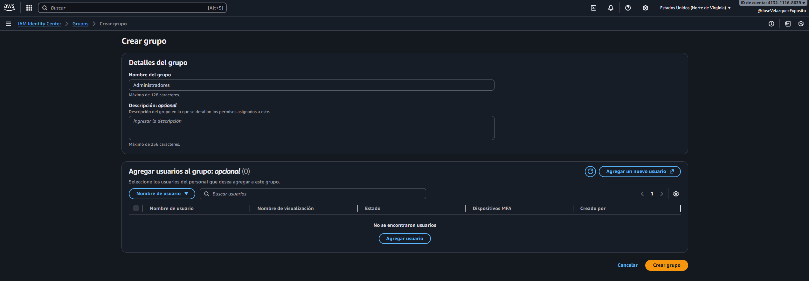

El grupo se crea inicialmente sin usuarios.

---

### 7.5 Usuario de ejemplo `Alicia`

Creo un usuario de prueba y lo añado al grupo:

1. En **Usuarios → Agregar usuario**.
2. En el **Paso 1**, completo:

   - Nombre de usuario: `Alicia`
   - Correo: `jvelazquez.aws.labs+alicia@gmail.com`
   - Nombre: `Alicia`
   - Apellidos: `Gimenez`
   - Contraseña: generada de un solo uso.

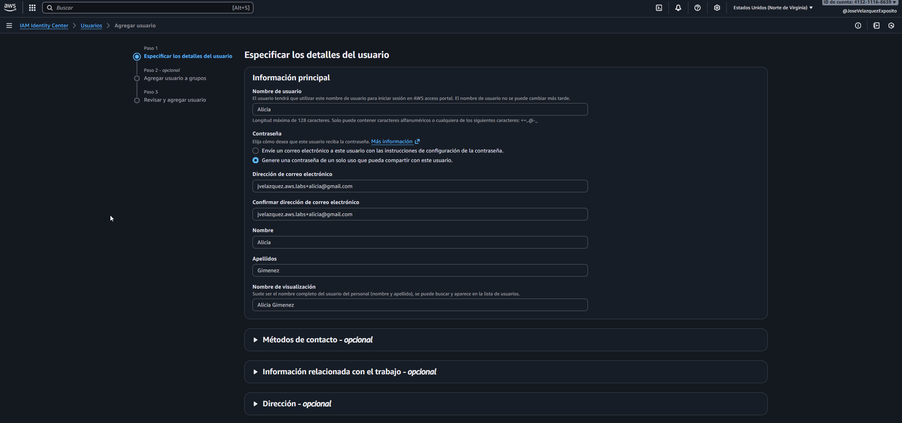

3. En el **Paso 2**, añado a `Alicia` al grupo `Administradores`.

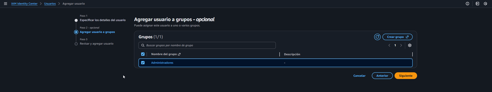

4. En el **Paso 3**, reviso y creo el usuario.

Al finalizar, Identity Center muestra la contraseña temporal y la URL del portal:

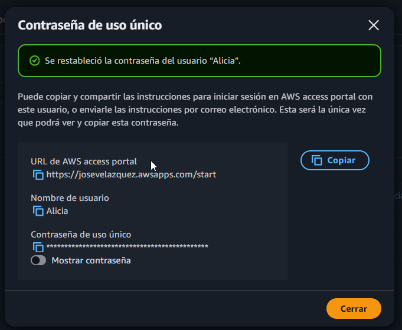

---

### 7.6 Asignar el grupo a las cuentas de AWS

Ahora vinculo el grupo `Administradores` con las cuentas del laboratorio usando
el permission set `AdministratorAccess`.

1. En **Permisos para varias cuentas → Cuentas de AWS**, selecciono:

   - `AWS-DEV-JVELAZQUEZ`
   - `AWS-PROD-JVELAZQUEZ`

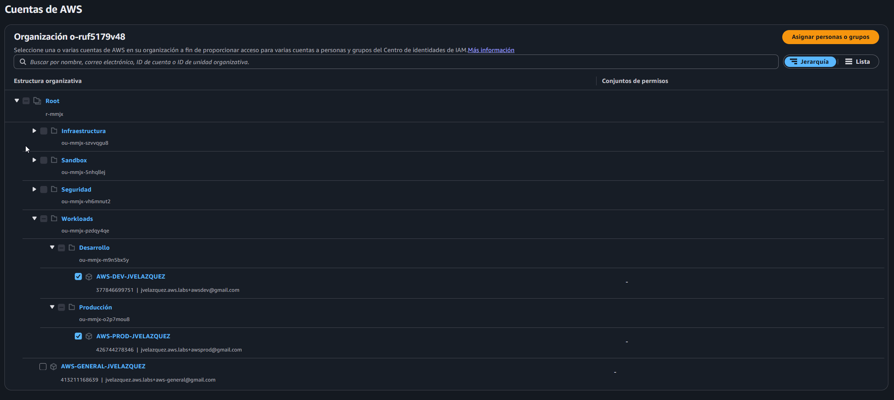

2. Pulso **Asignar personas o grupos** y, en el **Paso 1**, elijo el grupo `Administradores`.

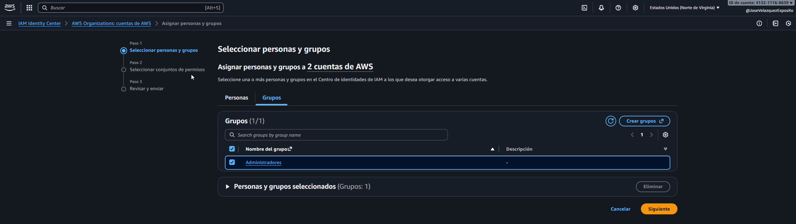

3. En el **Paso 2**, selecciono el conjunto de permisos `AdministratorAccess`.

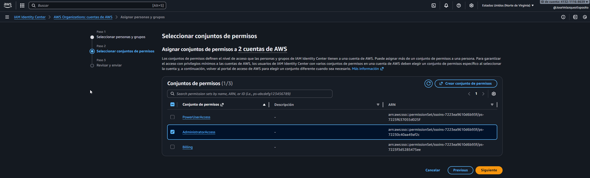

4. En el **Paso 3**, reviso el resumen y pulso **Enviar**.

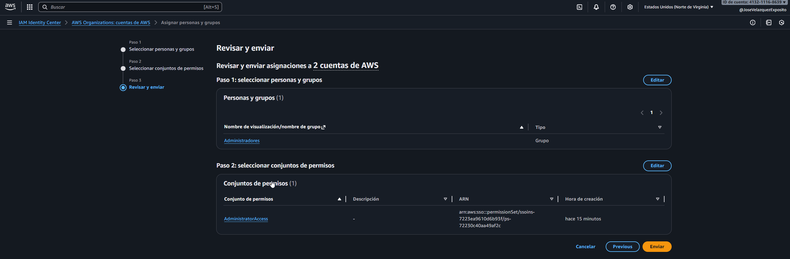

A partir de este punto, cualquier usuario que añada al grupo `Administradores`
tendrá acceso administrativo a las cuentas Dev y Prod a través del portal SSO.

---

### 7.7 Verificación de acceso desde el portal (usuario `Alicia`)

Para asegurarme de que todo funciona, pruebo el acceso real con `Alicia`:

1. Abro en el navegador:

```text
https://josevelazquez.awsapps.com/start
```

Introduzco el usuario `Alicia` y continúo.

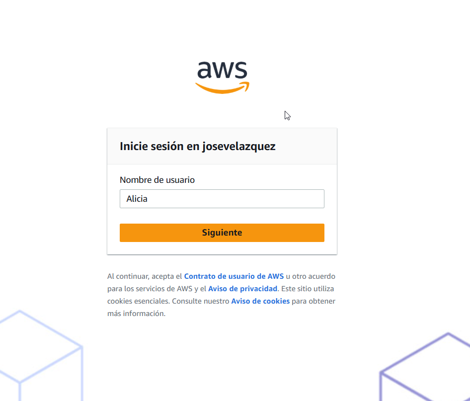

2. Escribo la contraseña de un solo uso generada anteriormente y pulso **Iniciar sesión**.

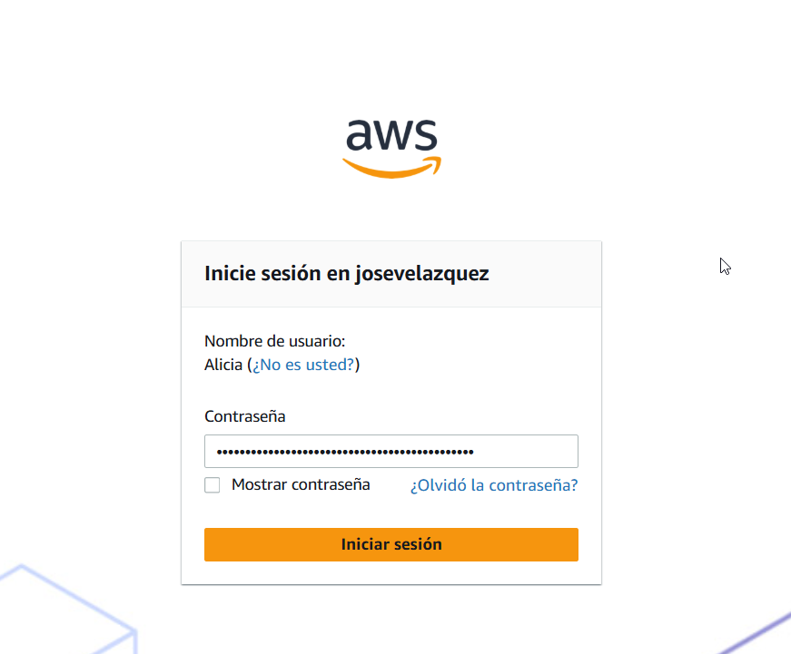

3. Si todo es correcto, el portal muestra las cuentas a las que `Alicia` tiene acceso:

   - `AWS-DEV-JVELAZQUEZ` (Desarrollo)  
   - `AWS-PROD-JVELAZQUEZ` (Producción)

   En ambas aparece disponible el conjunto de permisos `AdministratorAccess`.

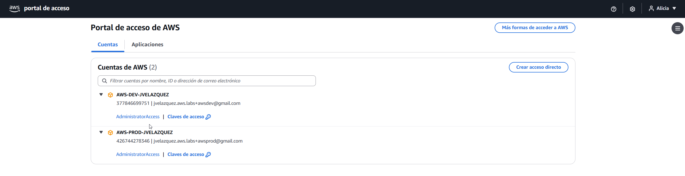

Con esta prueba confirmo que:

- El usuario `Alicia` se autentica correctamente en el portal de Identity Center.
- El grupo `Administradores` está vinculado al permission set `AdministratorAccess`.
- Las asignaciones sobre las cuentas de Desarrollo y Producción funcionan como se espera.


