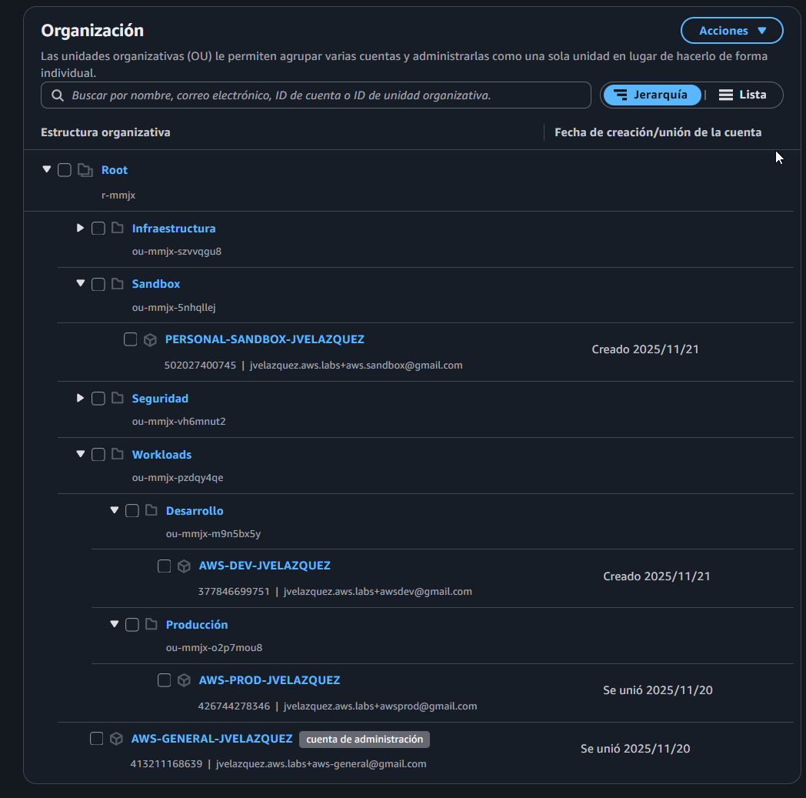
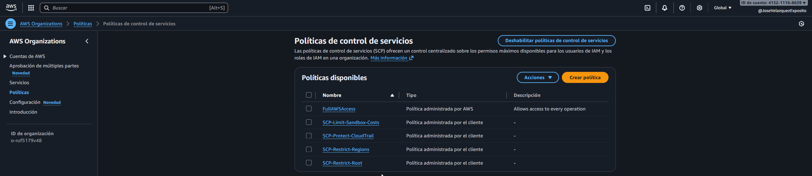

# 04 - Configuración actual de la organización

En este punto describo el **estado real** de la organización que he montado en AWS:

- Qué cuentas existen ahora mismo.
- Cómo están distribuidas en las OUs.
- Qué Service Control Policies (SCP) estoy usando.
- Cómo estoy gestionando el acceso con IAM Identity Center.

En `02-architecture.md` explico el **diseño objetivo** y en `03-implementation.md`
muestro el **how-to** para crear recursos concretos.  
Aquí enseño el **resultado actual del laboratorio**.

---

## 4.1 Estructura de cuentas y OUs

La organización está estructurada de la siguiente forma:

- **Management Account**
  - `AWS-GENERAL-JVELAZQUEZ`  
    - Cuenta de administración: billing, configuración global y capa de gobernanza.

- **OU Seguridad**
  - *(sin cuentas por ahora)*  
    - Pensada para futuras cuentas de `log-archive` y `audit`, donde centralizar logs
      y tareas de seguridad.

- **OU Infraestructura**
  - *(sin cuentas por ahora)*  
    - Pensada para servicios compartidos (bastion hosts, ECR común, herramientas
      internas, etc.).

- **OU Workloads**
  - **Sub-OU Producción**
    - `AWS-PROD-JVELAZQUEZ` → entorno de **producción**.
  - **Sub-OU Desarrollo**
    - `AWS-DEV-JVELAZQUEZ` → entorno de **desarrollo / no producción**.

- **OU Sandbox**
  - `PERSONAL-SANDBOX-JVELAZQUEZ` → entorno de **pruebas personales**.

Resumen en tabla:

| Nivel / OU             | Cuenta                        | Estado actual | Uso principal                               |
|------------------------|------------------------------|---------------|--------------------------------------------|
| Root                   | `AWS-GENERAL-JVELAZQUEZ`      | Creada        | Management, billing, gobernanza.           |
| Seguridad              | *(sin cuentas aún)*           | Creada        | Futuras cuentas de logs / auditoría.       |
| Infraestructura        | *(sin cuentas aún)*           | Creada        | Futuros servicios compartidos.             |
| Workloads / Producción | `AWS-PROD-JVELAZQUEZ`         | Creada        | Entorno de producción.                     |
| Workloads / Desarrollo | `AWS-DEV-JVELAZQUEZ`          | Creada        | Entorno de desarrollo / pruebas.           |
| Sandbox                | `PERSONAL-SANDBOX-JVELAZQUEZ` | Creada        | Entorno de sandbox personal.               |

Con esta estructura ya tengo separados **Prod**, **Dev** y **Sandbox**, y dejo preparadas
las OUs de **Seguridad** e **Infraestructura** para cuando la organización crezca.

---

## 4.2 SCP implementadas

Sobre esta estructura he definido varias **Service Control Policies (SCP)** para
empezar a aplicar gobernanza:

1. **`SCP-Restrict-Regions`**  
   - Objetivo: permitir solo un conjunto de regiones aprobadas (por ejemplo, `eu-west-1`).  
   - Idea: evitar despliegues accidentales en regiones que no quiero usar.

2. **`SCP-Restrict-Root`**  
   - Objetivo: limitar al máximo el uso del usuario **root**.  
   - Idea: el root no se utiliza para el trabajo diario, solo para tareas muy puntuales.

3. **`SCP-Protect-CloudTrail`**  
   - Objetivo: proteger CloudTrail (evitar que se pare, se borre o se modifique de forma
     peligrosa) en las cuentas de seguridad.  
   - De momento está pensada para cuando cree las cuentas `log-archive` y `audit` en la
     OU Seguridad.

4. **`SCP-Limit-Sandbox-Costs`**  
   - Objetivo: reducir el riesgo de costes altos en la OU `Sandbox`.  
   - Idea: bloquear ciertos recursos caros (por ejemplo, algunos tipos de instancias EC2
     grandes o RDS) en la cuenta de sandbox.

> La SCP `IAMDeny` que aparece en `03-implementation.md` la utilizo solo como
> **ejemplo de laboratorio** para entender el comportamiento de las SCP.  
> No forma parte del diseño final porque bloquea completamente IAM y es demasiado
> agresiva para un entorno real.

---

## 4.3 Mapa de SCP por OU y cuenta

En la tabla siguiente resumo dónde se aplican (o se aplicarán) cada una de las SCP:

- ✅ → la SCP se aplica (o está planificada para aplicarse) a esa OU / cuenta.  
- ❌ → la SCP no se aplica ahí.

| OU / Cuenta                 | SCP-Restrict-Regions | SCP-Restrict-Root | SCP-Protect-CloudTrail                      | SCP-Limit-Sandbox-Costs |
|----------------------------|----------------------|-------------------|---------------------------------------------|--------------------------|
| Root                       | ✅ (regla global)    | ✅ (regla global) | ❌                                          | ❌                       |
| Seguridad (OU)             | ✅                   | ✅                | ✅ (para `log-archive` y `audit` futuras)   | ❌                       |
| Infraestructura (OU)       | ✅                   | ✅                | ❌                                          | ❌                       |
| Workloads / Producción (OU)| ✅                   | ✅                | ❌ (los logs se centralizarán en Seguridad) | ❌                       |
| Workloads / Desarrollo (OU)| ✅                   | ✅                | ❌                                          | ❌                       |
| Sandbox / PERSONAL-SANDBOX | ✅                   | ✅                | ❌                                          | ✅                       |

Decisiones principales:

- **Restrict-Regions** y **Restrict-Root** actúan como **políticas base**, aplicadas
  de forma amplia (Root y OUs principales).
- **Protect-CloudTrail** se reserva para las futuras cuentas de Seguridad, que serán
  las que centralicen los logs.
- **Limit-Sandbox-Costs** se aplica únicamente en `Sandbox`, que es donde hago pruebas
  y quiero limitar el riesgo de activar recursos muy caros por error.

---

## 4.4 Modelo de acceso con IAM Identity Center

Además de la estructura de OUs y SCP, la organización ya utiliza
**IAM Identity Center** como capa centralizada de acceso:

- **Instancia de IAM Identity Center**
  - Región: `us-east-1`.
  - Fuente de identidad: *Directorio de Identity Center* (usuarios y grupos gestionados
    directamente en AWS).
  - Portal de acceso personalizado:  
    `https://josevelazquez.awsapps.com/start`.

- **Conjunto de permisos principal**
  - `AdministratorAccess` (permission set predefinido de AWS).
  - Duración de la sesión: 4 horas.
  - Uso actual: conceder permisos administrativos en las cuentas de laboratorio.

- **Grupos y usuarios**
  - Grupo: `Administradores`.
    - Representa al equipo que administra las cuentas de la organización.
  - Usuario de ejemplo: `Alicia`  
    - Creado en el directorio de Identity Center.  
    - Miembro del grupo `Administradores`.  
    - Se le entrega una contraseña de un solo uso para el primer inicio de sesión.

- **Asignaciones a cuentas**
  - El grupo `Administradores` tiene asignado el permission set `AdministratorAccess` en:
    - `AWS-DEV-JVELAZQUEZ` (Desarrollo).
    - `AWS-PROD-JVELAZQUEZ` (Producción).

En la práctica, esto significa que:

1. `Alicia` entra al portal en  
   `https://josevelazquez.awsapps.com/start`.
2. Inicia sesión con su usuario y contraseña.
3. El portal le muestra las cuentas **DEV** y **PROD**, cada una con el rol
   `AdministratorAccess` disponible.
4. Desde ahí puede elegir a qué cuenta acceder y con qué nivel de permisos.

Este modelo es sencillo, pero ya refleja una gestión de acceso coherente:

- Las identidades de los usuarios viven en Identity Center, no en cada cuenta.
- El acceso a las cuentas se hace por grupos y permission sets, no por usuarios sueltos.

---

## 4.5 Qué aporta esta configuración

Con la combinación de **cuentas**, **OUs**, **SCP** e **Identity Center** consigo:

- **Separación clara de entornos**  
  Producción, Desarrollo y Sandbox viven en cuentas diferentes y en OUs distintas.
  Un problema en Sandbox o en Dev no debería impactar directamente a Producción.

- **Reglas base de seguridad comunes**  
  - Restricción de regiones (`SCP-Restrict-Regions`).  
  - Uso del usuario root muy acotado (`SCP-Restrict-Root`).

- **Primeros pasos en seguridad y control de costes**
  - Diseño preparado para proteger CloudTrail en las futuras cuentas de Seguridad.  
  - Sandbox con una SCP específica para limitar recursos caros.

- **Gestión centralizada de identidades y accesos**
  - IAM Identity Center como punto único de acceso.  
  - Grupos (como `Administradores`) para asignar permisos de manera consistente
    en varias cuentas.

- **Arquitectura preparada para crecer**
  - Puedo añadir sin problemas nuevas cuentas a las OUs de Seguridad e Infraestructura.  
  - Las mismas SCP y el mismo modelo de Identity Center se podrán reutilizar para
    entornos adicionales (por ejemplo, `staging`, `testing` o nuevas regiones aprobadas).

